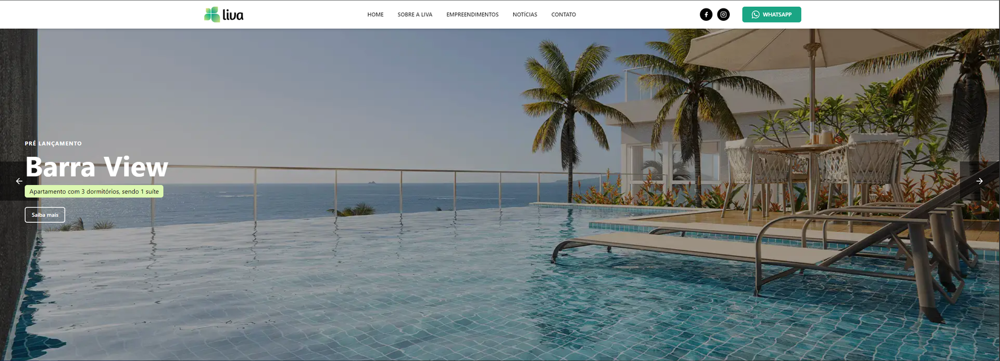

# 🏡 Liva Empreendimentos: Desafio Técnico



> Na Liva, cada projeto é planejado para facilitar a vida dos moradores, trazendo uma sensação máxima de bem-estar. Espaços que abrigam histórias de vida e que são desenvolvidos para que você viva momentos incríveis ao lado da sua família.

---

## 🚀 Sobre o Projeto

**Liva Empreendimentos** é uma aplicação web moderna e responsiva, desenvolvida como um desafio técnico para demonstrar a construção de uma interface rica e acessível utilizando React com o prazo de desenvolvimento de 2(dois) dias.

O projeto foi criado do zero, com foco na qualidade de código, acessibilidade (a11y) e na criação de uma biblioteca de componentes reutilizáveis, seguindo as melhores práticas de desenvolvimento Front-End.

## ✨ Principais Funcionalidades

- **🖼️ &nbsp; Carrossel Interativo e Acessível:** Um carrossel de imagens para destacar os empreendimentos, com suporte para navegação via teclado e anúncios para leitores de tela.
- **📝 &nbsp; Formulário de Contato com Validação:** Formulário completo com validação de dados em tempo real (usando Zod) e foco automático em campos inválidos para melhor acessibilidade.
- **🧩 &nbsp; Biblioteca de Componentes Reutilizáveis:** Uma coleção de componentes (Atoms, Molecules, Organisms) construídos com base no Radix UI para garantir acessibilidade, incluindo botões, inputs, selects e cards.
- **📱 &nbsp; Design Responsivo:** Experiência de uso otimizada para desktops, tablets e smartphones, construída com Tailwind CSS.

## 🛠️ Tecnologias Utilizadas

Este projeto foi construído com um conjunto de tecnologias modernas e robustas, focadas em performance e na melhor experiência de desenvolvimento.

- **Frontend:**
  - **Framework:** [Next.js](https://nextjs.org/) (v15) com App Router e Turbopack
  - **Linguagem:** [TypeScript](https://www.typescriptlang.org/)
  - **UI Library:** [React](https://react.dev/) (v19)
  - **Estilização:** [Tailwind CSS](https://tailwindcss.com/)
  - **Componentes:** [shadcn/ui](https://ui.shadcn.com/) (construído sobre Radix UI)
  - **Ícones:** [Lucide React](https://lucide.dev/)
- **Formulários:**
  - **Gerenciamento:** [React Hook Form](https://react-hook-form.com/)
  - **Validação:** [Zod](https://zod.dev/)
- **Qualidade de Código:**
  - **Linter:** [ESLint](https://eslint.org/)
  - **Formatter:** [Prettier](https://prettier.io/)

## 📂 Estrutura do Projeto

A arquitetura do projeto é baseada em componentes, organizada de forma atômica para facilitar a manutenção e escalabilidade.

```
c:/Dev/technical-challenge/
├───public/               # Arquivos estáticos (imagens, ícones)
└───src/
    ├───app/              # Rotas, layouts e páginas
    ├───components/       # Componentes reutilizáveis
    │   ├───atom/         # Componentes base (Button, Input, etc.)
    │   ├───molecules/    # Componentes compostos
    │   └───organisms/    # Seções completas (ContactForm)
    └───lib/              # Funções utilitárias
```

## 🏁 Como Executar o Projeto Localmente

Siga os passos abaixo para configurar e executar o projeto em seu ambiente de desenvolvimento.

1.  **Clone o repositório:**

    ```bash
    git clone https://github.com/seu-usuario/technical-challenge.git
    cd technical-challenge
    ```

2.  **Instale as dependências:**

    ```bash
    npm install
    ```

3.  **Execute o servidor de desenvolvimento:**

    ```bash
    npm run dev
    ```

4.  **Abra no navegador:**
    Acesse [http://localhost:3000](http://localhost:3000) para ver a aplicação em funcionamento.

## 📄 Licença

Este projeto está sob a licença MIT.
